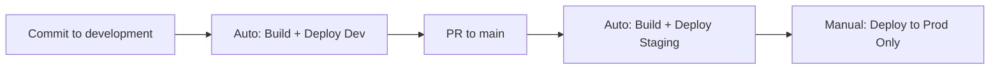
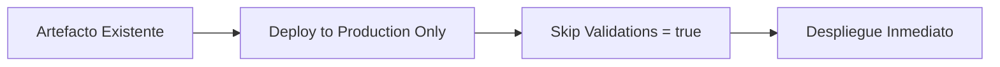

# 🚀 Estrategia de Despliegue - Build Once Deploy Many

Este proyecto implementa dos estrategias complementarias de despliegue siguiendo las mejores prácticas de CI/CD.

## 📋 Workflows Disponibles

### 1. 🔨 Build Once Deploy Many (`build-once-deploy-many.yml`)
**Uso**: Desarrollo normal y despliegues automáticos

#### Triggers:
- **Push a `development`** → Build + Deploy to Development
- **Push a `main`** → Build + Deploy to Development + Staging  
- **Manual** → Build + Deploy según configuración

#### Características:
- ✅ Build completo con tests
- ✅ Despliegue automático por ramas
- ✅ Opción de despliegue manual a Production
- ⚠️ **Recompila todo** (incluye tests completos)

### 2. 🏭 Deploy to Production Only (`deploy-to-production.yml`)
**Uso**: Despliegue rápido a Production reutilizando artefactos

#### Triggers:
- **Solo Manual** con parámetros específicos

#### Características:
- ✅ **NO recompila** - Reutiliza artefacto existente
- ✅ Validaciones críticas mínimas
- ✅ Despliegue directo y rápido
- ✅ Modo emergencia (skip validations)

## 🎯 Cuándo Usar Cada Estrategia

### 📈 Flujo Normal de Desarrollo



### 🚨 Despliegue de Emergencia



## 🔧 Cómo Usar

### Desarrollo Normal:

1. **Development**:
   ```bash
   git push origin development
   # → Automático: Build + Deploy to Development
   ```

2. **Staging**:
   ```bash
   git checkout main
   git merge development
   git push origin main
   # → Automático: Build + Deploy to Development + Staging
   ```

3. **Production (Eficiente)**:
   - Ve a Actions → "🏭 Deploy to Production Only"
   - Introduce el **Run ID** del build de staging
   - Click "Run workflow"
   - ✅ Despliegue rápido sin recompilación

### Despliegue de Emergencia:

1. **Identificar artefacto válido**:
   - Busca un workflow exitoso reciente
   - Copia su Run ID (ej: 1234567890)

2. **Despliegue rápido**:
   - Workflow: "🏭 Deploy to Production Only"
   - Run ID: 1234567890
   - Skip validations: `true` (solo emergencias)

## 📊 Comparación de Estrategias

| Aspecto | Build Once Deploy Many | Deploy to Production Only |
|---------|------------------------|---------------------------|
| **Tiempo** | ~5-10 minutos | ~2-3 minutos |
| **Tests** | Completos | Solo críticos |
| **Build** | Nuevo | Reutiliza existente |
| **Seguridad** | Máxima | Configurable |
| **Uso** | Desarrollo normal | Production/Emergencias |

## 🎯 Beneficios

### ✅ **Eficiencia**:
- Production no requiere recompilación
- Despliegues más rápidos
- Menos uso de recursos

### ✅ **Consistencia**:
- Mismo artefacto en todos los entornos
- Elimina "funciona en staging pero no en prod"

### ✅ **Flexibilidad**:
- Desarrollo normal automatizado
- Despliegues de emergencia rápidos
- Control granular por entorno

### ✅ **Trazabilidad**:
- Relación clara entre builds y despliegues
- Metadatos completos en cada artefacto
- Historial de despliegues

## 🔍 Información de Artefactos

Cada artefacto incluye:

```json
{
  "version": "main-abc123",
  "build_date": "2024-01-15T10:30:00Z",
  "commit_sha": "abc123def456",
  "branch": "main",
  "built_by": "developer",
  "workflow_run": "42",
  "repository": "user/calculadora"
}
```

## 📋 Checklist de Despliegue a Production

### Antes del Despliegue:
- [ ] Artefacto probado en Staging
- [ ] Tests de integración pasados
- [ ] Aprobación del equipo
- [ ] Ventana de mantenimiento (si aplica)

### Durante el Despliegue:
- [ ] Monitorear logs en tiempo real
- [ ] Verificar health checks
- [ ] Confirmar funcionalidad crítica

### Después del Despliegue:
- [ ] Monitorear métricas 30 minutos
- [ ] Verificar con usuarios clave
- [ ] Documentar el despliegue
- [ ] Plan de rollback listo

## 🚨 Rollback

Si necesitas hacer rollback:

1. **Identificar último artefacto bueno**
2. **Usar "Deploy to Production Only"**
3. **Activar "Skip validations" si es urgente**
4. **Monitorear después del rollback**

---

*Esta estrategia sigue las mejores prácticas de Azure DevOps y GitHub Actions para el examen GH-200*